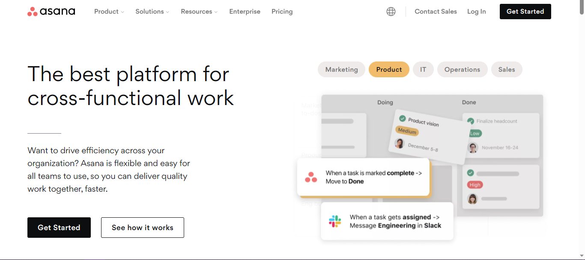
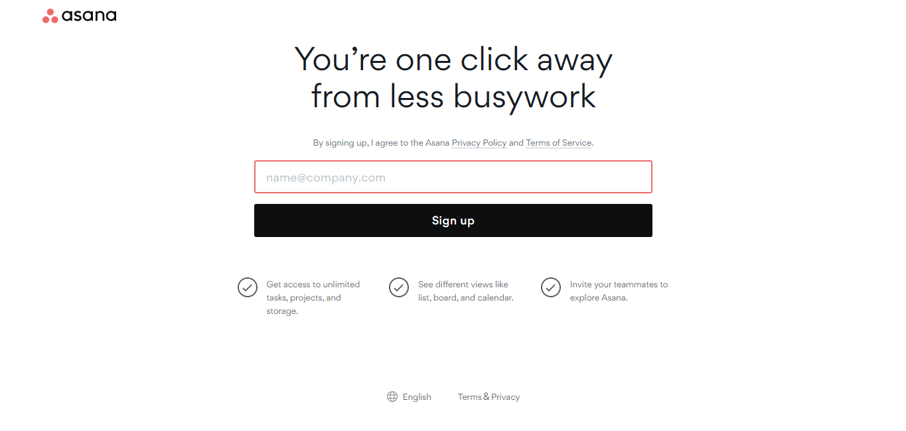
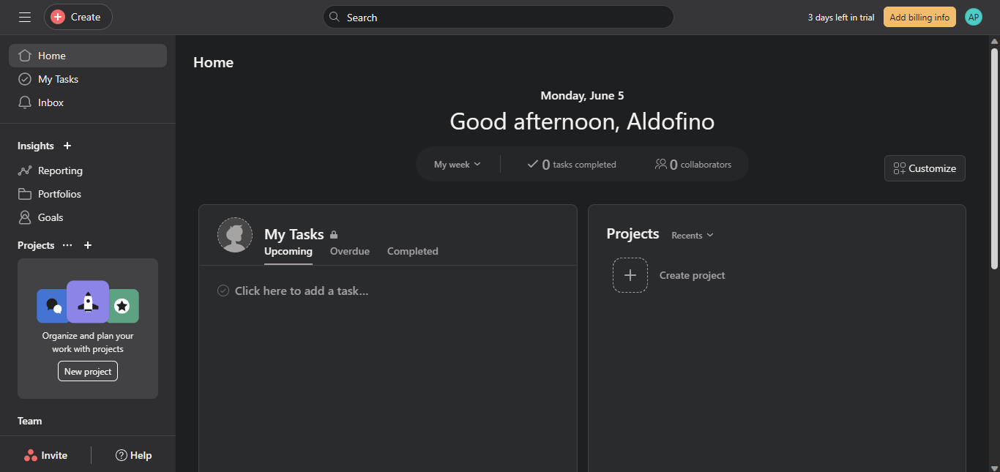
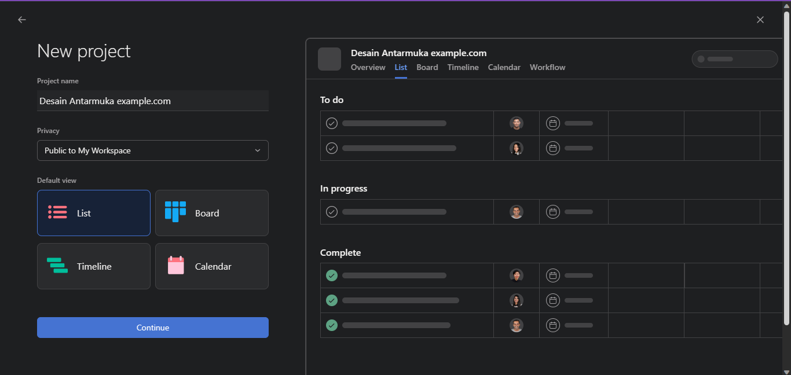
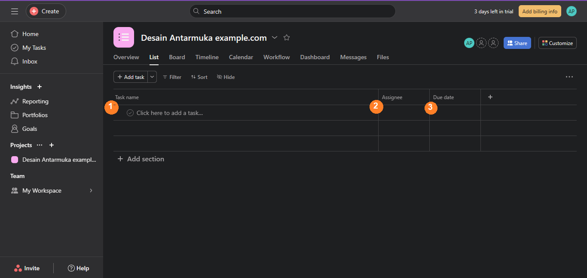
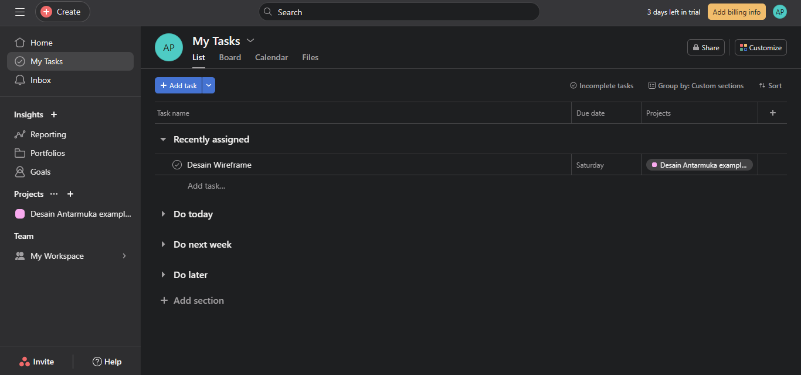

# Ringkasan Tools Manajemen Proyek Asana

Tugas Manajamen Proyek UPN "Veteran" Jawa Timur

---

*Halaman utama website Asana*

Asana adalah software manajemen proyek yang didesain untuk mengoptimasi kolaborasi antar pengguna. Pengguna dapat membuat proyek, membagi tugas, mengatur deadline, dan berkomunikasi langsung dengan menggunakan Asana. Asana juga mendukung tools untuk membuat laporan, melampirkan file, kalender, dan melacak sasaran proyek. Asana dapat digunakan langsung di web browser atau sebagai aplikasi desktop. Dokumentasi lengkap Asana dapat dilihat [disini](https://asana.com/guide/help).

## Membuat Akun

Untuk membuat akun Asana, klik tombol "Get Started" di halaman utama website Asana. Pengguna akan diarahkan ke halaman sign up.

*Halaman pendaftaran Asana*

Masukkan email dan klik "Sign Up". Pengguna akan menerima email verifikasi dari Asana. Setelah memverifikasi email, pengguna dapat mengikuti arahan dari Asana untuk **membuat proyek pertama**. Untuk sekarang, langkah ini dapat dilewati. Langsung menuju ke aplikasi Asana untuk memulai membuat proyek.

## Membuat Proyek

Saat pertama kali masuk ke aplikasi Asana, pengguna akan diarahkan ke halaman home aplikasi Asana. Dua elemen paling penting di Asana adalah *My Tasks* dan *Projects*.

*Tampilan utama aplikasi Asana*

- Untuk membuat proyek baru, klik tombol **+ Create Project** di sebelah kanan.
- Di halaman selanjutnya, pilih "**Blank Project**".

- Setelah itu, pengguna dapat menulis nama proyek, privasi, dan tampilan tugas. Untuk sekarang, beri nama proyek lalu klik **Continue**.
- Di halaman selanjutnya, pilih **Go to project**.
- Pengguna akan diarahkan ke tampilan proyek yang telah dibuat.

## Menambah dan Membagi Tugas

Pengguna dapat membagi tugas ke anggota tim atau anggota yang diundang ke proyek yang sama.

1. Klik di sini untuk memberi nama tugas.
2. Klik di sini untuk menetapkan anggota untuk tugas tersebut. Untuk sekarang, pengguna dapat menetapkan diri sendiri untuk tugas tersebut.
3. Klik di sini untuk menetapkan *due date* atau *deadline*.

## My Tasks

Pada tampilan *My Tasks*, pengguna dapat melihat semua tugas yang diberikan kepadanya. Pengguna juga dapat menambahkan tugas pribadi langsung dari sini. Secara default, tugas yang baru diberikan akan tercantum pada bagian **Recently Assigned**.